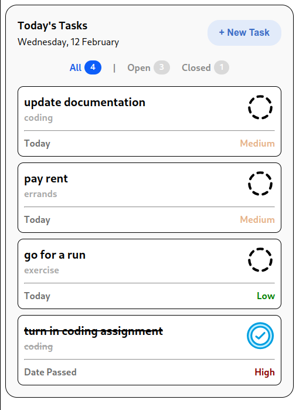
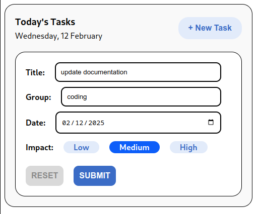
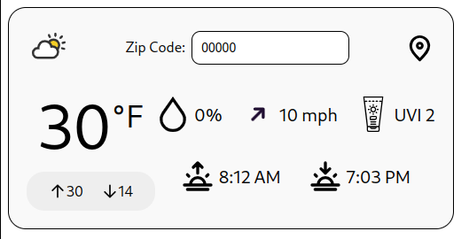

# hub

## overview

this project allows you to have your own customizable productivity hub with essential tools such as a todo list or weather widget with more widgets being actively built.

## installation

```bash
git clone https://github.com/tkofb/hub.git
```

## usage

```bash
cd hub/

npm install

npm run dev
```

## current widgets

- #### to-do list
	- 
  - 
- #### weather
	- 

## planned widgets

- #### stock watchlist
- #### pomodoro timer
- #### calendar integration
- #### notes
- #### lofi music
- #### habit tracker

## contributing

pull requests are welcome. for major changes, please open an issue first  
to discuss what you would like to change.  

please make sure to update tests as appropriate.  

## license

[MIT](https://choosealicense.com/licenses/mit/)
